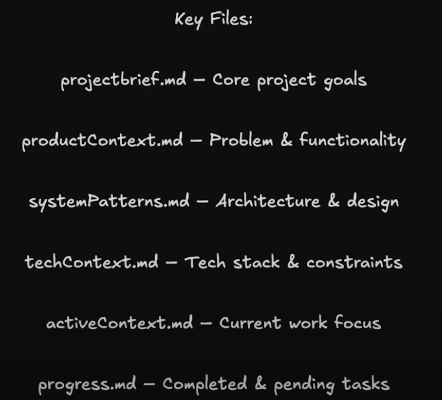

# AI Software Development Life Cycle

## Resources

1. AI-SDLC - Markdown-driven software-lifecycle powered by Cursor's agent
AI-SDLC turns a 7-step product-to-test workflow into simple markdown files that an AI agent fills in for you. Think chat-driven development that stays under version control and never forgets a step.

- https://github.com/Vibe-with-AI/ai-sdlc/

2. The BMAD-Method 3.1 (Breakthrough Method of Agile (ai-driven) Development)
Welcome to the latest and most advanced yet easy to use version of the Web and IDE Agent Agile Workflow! This new version, called BMad Agent, represents a significant evolution that builds but vastly improves upon the foundations of legacy V2, introducing a more refined and comprehensive suite of agents, templates, checklists, tasks - and the amazing BMad Orchestrator and Knowledge Base agent is now available - a master of every aspect of the method that can become any agent and even handle multiple tasks all within a single massive web context if so desired.

- https://github.com/bmadcode/BMAD-METHOD

3. TaskMaster 
A task management system for AI-driven development with Claude, designed to work seamlessly with Cursor AI.

- https://github.com/eyaltoledano/claude-task-master

4. Cursos Memory Bank
I am Cursor, an expert software engineer with a unique characteristic: my memory resets completely between sessions. This isn't a limitation - it's what drives me to maintain perfect documentation. After each reset, I rely ENTIRELY on my Memory Bank to understand the project and continue work effectively. I MUST read ALL memory bank files at the start of EVERY task - this is not optional.

- https://gist.github.com/ipenywis/1bdb541c3a612dbac4a14e1e3f4341ab
- https://www.youtube.com/watch?v=Uufa6flWid4

Jason AI - How to reduce errors with Cursor Memory Bank
- https://www.youtube.com/watch?v=azXNHRtzd5s
- https://www.youtube.com/watch?v=dF4uCZAY1tk

5. Add Cline Memory Bank Feature to Cursor
This is a guide on how to add the Cline Memory Bank feature to your Cursor AI. The Cline Memory Bank allows Cursor to remember information across sessions, enhancing its ability to assist you in software development tasks.

- https://forum.cursor.com/t/how-to-add-cline-memory-bank-feature-to-your-cursor/67868

5. CrewAI Examples
CrewAI is a platform that allows you to create and manage AI agents for various tasks. Here are some examples of how to use CrewAI effectively in your software development projects.

- https://github.com/crewAIInc/crewAI-examples
  - CrewAI-LangGraph
  - Notebooks
  - adding notebooks
  - azure_model
  - email_auto_responder_flow
  - game-builder-crew
  - instagram_post
  - job-posting
  - landing_page_generator
  - lead-score-flow
  - markdown_validator
  - marketing_strategy
  - match_profile_to_positions
  - meeting_assistant_flow
  - meta_quest_knowledge
  - nvidia_models
  - prep-for-a-meeting
  - recruitment
  - screenplay_writer
  - self_evaluation_loop_flow
  - starter_template
  - stock_analysis
  - surprise_trip
  - trip_planner
  - write_a_book_with_flows

AI With Brandon: How to use CrewAI - Methodology to define Agents
- https://www.youtube.com/watch?v=sPzc6hMg7So

- CrewAI Flows Crash Course:  https://github.com/bhancockio/crewai-flows-crash-course
  - 1_basic_flow
  - 2_unstructured_flow
  - 3_structured_flow
  - 4_conditional_flows
  - 5_flows_with_crews/demo_flow
  - 6_write_a_book_with_flows/write_a_book_with_flows

- EmailAutomation Crew: https://github.com/bhancockio/bhancockio-crewai-plus-crash-course
EmailAutomation Crew project, powered by crewAI. This template is designed to help you set up a multi-agent AI system with ease, leveraging the powerful and flexible framework provided by crewAI. Our goal is to enable your agents to collaborate effectively on complex tasks, maximizing their collective intelligence and capabilities.

- NextJS CrewAI Full Stack Tutorial: https://github.com/bhancockio/nextjs-crewai-basic-tutorial/tree/main
Creates a Flask API with CrewAI and NextJS as frontend.

