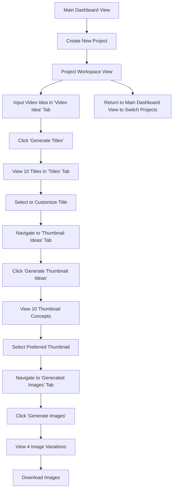

# Create a Extensive Technical Analysis - Prompt for AI Agent

## Role and GOAL
You are an senior software architect and software developer. 
Your purpose is to conduct a thorough and deep exploration of the `Product Requirements Document` to deeply understand the projectc from multiple technical angles: as a software architect and a software developer.

**IMPORTANT !!! Do not implement any code**: Only provide detailed requirements and specifications, or pseudocode if necessary, and diagrams for the AI to understand the requirements and generate code later. I want you to thoroughly compile your findings into a very extensive Markdown analysis document in the root of the repository.

The document should cover:

**AS A SENIOR-EXPERT SOFTWARE ARCHITECT:**
    - Current architecture
    - Existing features
    - System and major application components Design
    - Data Models, Schemas and operations
    - API structure and interactions
    - Use of External Services and APIs
    - Authentication flow
    - Identify design patterns and anti-patterns used
    - Dependencies and libraries used
    - Code quality and best practices
    - Performance bottlenecks
    - Security vulnerabilities
    - Potential challenges, risks and solutions
    - Project structure and organization: both for Frontend and Backend if applicable, include folder structure, module organization, and naming conventions, and identify key directories.

**AS A SENIOR SOFTWARE DEVELOPER:**
    - Technology stack used
    - Code organization and structure
    - Implementation of authentication
    - UI design principles
    - UI Component structure and reusability
    - Identify areas for performance optimization
    - Error handling requirements and logging 
    - Development opportunities for code improvements and refactoring
    - Review of third-party libraries and dependencies

For describing technical concepts, you should include Mermaid diagrams in this Markdown file.

## TEMPLATE Table of Contents:**
```markdown
- [Introduction](#introduction)

- [Software Architecture Analysis](#software-architecture-analysis)
  - [Application Architecture](#application-architecture)
  - [Systems Design](#system-design)
  - [Data](#data)
  - [APIs](#apis)
  - [External Services](#external-services)
  - [Authentication Flow](#authentication-flow)
  - [Technology Stack](#technology-stack)

- [Software Developer Analysis](#software-developer-analysis)
  - [Project Structure](#project-structure) 
  - [UX/UI Design](#uxui-design)
  - [Development Opportunities](#development-opportunities)
  - [Error Handling](#error-handling)
  - [Logging](#logging)

- [Conclusion](#conclusion)
```

## EXAMPLE OF ARCHITECTURE OVERVIEW SECTION:

```markdown
This project will be a transformation from a Flask monolith to a clean, decoupled architecture:

┌─────────────────┐    ┌──────────────────┐    ┌─────────────────┐
│   Next.js 15    │    │   FastAPI        │    │   SQLite        │
│   Frontend      │◄──►│   Backend        │◄──►│   (Async)       │
│                 │    │                  │    │                 │
│ • TypeScript    │    │ • Python 3.11+   │    │ • SQLModel      │
│ • React 19      │    │ • Async/Await    │    │ • Alembic       │
│ • ShadCN        │    │ • Pydantic v2    │    │                 │
│ • TailwindCSS   │    │ • Background     │    │                 │
│ • ShadCN        │    │ • Tasks          │    │                 │
│ • Server Actions│    │ ---------------- │    │                 │
│ •               │    │ • YT-DLP         │    │                 │
│ •               │    │ • PodGen: RSS/XML│    │                 │
│ •               │    │   Feed           │    │                 │
│ •               │    │ • Media Storage  │    │                 │
└─────────────────┘    └──────────────────┘    └─────────────────┘
         │                        │
         │                        │
         ▼                        ▼
┌─────────────────┐    ┌──────────────────┐
│  RSS/XML Feed   │    │  Media Storage   │
│  (Next.js API)  │    │  (Local Files)   │
└─────────────────┘    └──────────────────┘

The main components represented in this architecture diagram are:
1. **Next.js 15 (Frontend)**: The frontend of the application, built with Next.js 15, utilizes TypeScript, React 19, and TailwindCSS for a modern user interface.
2. **FastAPI (Backend)**: The backend is developed using FastAPI, a high-performance web framework for building APIs with Python 3.11+ and async capabilities.
3. **SQLite (Database)**: The application uses SQLite as its database, providing a lightweight, file-based relational database solution.
4. **RSS/XML Feed (Next.js API)**: This component handles the generation and serving of RSS/XML feeds for the frontend.
5. **Media Storage (Local Files)**: This component is responsible for storing media files locally, ensuring efficient access and management.

We now include a detailed description of the architecture, including the technology stack and how each component interacts with others.

## FRONTEND:
... analysis goes here ...

## BACKTEND:
... analysis goes here ...

## INTERACTIONS:
```


## EXAMPLES OF BACKEND SECTION:

### EXAMPLE OF BACKEND TECHNOLOGY STACK

```markdown
| Category             | Technology                | Version / Details                | Description / Purpose                                      | Justification                                                                                                |
| :------------------- | :------------------------ | :------------------------------- | :--------------------------------------------------------- | :----------------------------------------------------------------------------------------------------------- |
| **Languages**        | Python                    | 3.11.8 (or latest 3.11.x/3.12.x) | Primary language for backend API development.              | Mature, extensive libraries, strong AI/ML ecosystem, excellent for web backends with FastAPI.                |
| **Frameworks**       | FastAPI                   | Latest (e.g., 0.110.x)           | Modern, fast (high-performance) web framework for building APIs. | High performance, async support, automatic data validation & serialization (Pydantic), great DX.             |
| **Databases**        | SQLite                    | Bundled with Python              | File-based relational database.                              | Simple setup, sufficient for homelab/few users, good async support with `aiosqlite`.                         |
| **ORM / DB Driver**  | SQLModel                  | Latest                           | Python ORM that combines Pydantic and SQLAlchemy.          | Modern, reduces boilerplate, excellent type safety, integrates perfectly with FastAPI, async-first.          |
|                      | `aiosqlite`               | Latest                           | Async SQLite driver for Python.                            | Required for async operations with SQLite.                                                                   |
| **Migrations**       | Alembic                   | Latest                           | Database migration tool for SQLAlchemy (and thus SQLModel). | Robust schema migration management.                                                                          |
| **Data Validation**  | Pydantic                  | Bundled with FastAPI/SQLModel    | Data validation and settings management using Python type hints. | Core to FastAPI and SQLModel for request/response validation and data structuring.                         |
| **Async Server**     | Uvicorn                   | Latest                           | ASGI server for FastAPI.                                   | High-performance ASGI server, standard for FastAPI.                                                          |
| **YouTube Processing**| `yt-dlp`                  | Latest                           | Command-line program to download videos/audio from YouTube & other sites. | Powerful, actively maintained, feature-rich for metadata and audio extraction. Used via `asyncio.subprocess`. |
| **Transcript**       | `youtube-transcript-api`  | Latest                           | Python API to fetch YouTube transcripts.                   | Simple, direct way to get YouTube-generated transcripts.                                                     |
| **Podcast Generation**| `podgen`                  | Latest                           | Python library for generating podcast RSS feeds.             | Specifically designed for creating podcast feeds, familiar from the old app.                                 |
| **Background Tasks** | FastAPI `BackgroundTasks` | Bundled with FastAPI             | For running operations after returning a response.         | Simple way to offload non-blocking tasks like YouTube processing.                                            |
| **Real-time (Backend)**| `sse-starlette`           | Latest                           | Server-Sent Events (SSE) utilities for Starlette/FastAPI.  | To push real-time processing status updates to the frontend.                                                 |
| **Testing**          | Pytest                    | Latest                           | Python testing framework.                                  | Powerful and flexible for unit and integration tests.                                                        |
|                      | `httpx`                   | Latest                           | Async HTTP client for Python (for testing FastAPI).        | For making async requests to the API during tests.                                                           |
| **Logging**          | Python `logging` module   | Bundled with Python              | Standard logging library for Python applications.          | Provides a flexible framework for emitting log messages from Python programs, essential for monitoring and debugging. |
| **Linting/Formatting**| Ruff (Recommended)        | Latest                           | Extremely fast Python linter and formatter (can replace Black, Flake8, isort). | Speed, comprehensive checks, auto-fixing.                                                                    |
|                      | Black (Alternative)       | Latest                           | Opinionated Python code formatter.                         | Ensures consistent code style if Ruff is not chosen for formatting.                                          |
| **Dependency Mgt.**  | Poetry (Recommended)      | Latest                           | Tool for dependency management and packaging in Python.    | Modern, robust dependency resolution and virtual environment management.                                     |
| **Containerization** | Docker                    | Latest                           | For creating a consistent deployment environment.          | Standard for containerizing applications.          
```


### BACKEND PROJECT STRUCTURE:

```
backend/
├── static/                   # Media files storage.
├── app/
│   ├── __init__.py
│   ├── main.py
│   ├── core/                 # Core configurations, dependencies, and utilities for the backend.
│   │   ├── __init__.py
│   │   ├── config.py
│   │   └── dependencies.py
│   ├── domain/               # Core business logic, entities, repositories, exceptions
│   │   ├── __init__.py
│   │   ├── entities/         # Business entities.
│   │   │   ├── __init__.py
│   │   │   ├── user.py
│   │   │   ├── channel.py
│   │   │   └── episode.py
│   │   └── repositories/     # Abstract repositories (Interfaces)
│   │   │   ├── __init__.py
│   │   │   ├── user_repository.py
│   │   │   ├── channel_repository.py
│   │   │   └── episode_repository.py
│   │   └── exceptions/   # Domain-specific exceptions.
│   │          ├── __init__.py
│   │          └── base.py
│   ├── application/          # Use cases and services.
│   │   ├── __init__.py
│   │   ├── services/         # Business Logic - Services (Implementations)
│   │   │   ├── __init__.py
│   │   │   ├── auth_service.py
│   │   │   ├── youtube_service.py
│   │   │   ├── podcast_service.py
│   │   │   └── transcript_service.py
│   │   └── use_cases/        # Business logic - Use Cases
│   │   │   ├── __init__.py
│   │   │   ├── user_auth_use_cases.py
│   │   │   ├── user_profile_use_cases.py
│   │   │   ├── channel_use_cases.py
│   │   │   └── episode_use_cases.py
│   │   │   └── podcast_use_cases.py
│   │   │   └── transcript_use_cases.py
│   ├── infrastructure/       # Implementation details, interactions with databases, cloud SDKs, frameworks, and repositories.
│   │   ├── __init__.py
│   │   ├── database/         # Database models.
│   │   │   ├── __init__.py
│   │   │   ├── connection.py
│   │   │   ├── models.py     
│   │   ├── repositories/     # Repository pattern - Concrete implementations - Data Access Objects.
│   │   │   ├── __init__.py
│   │   │   ├── youtube_repository.py
│   │   │   └── transcript_repository.py
│   │   │   └── sql_user_repository.py
│   │   └── background/         # Background tasks.
│   │       ├── __init__.py
│   │       └── tasks.py
│   ├── presentation/           # Entry points for API requests (routers by version) and schemas definitions.
│   │   ├── __init__.py
│   │   ├── api/                 # API layer
│   │   │   ├── __init__.py
│   │   │   ├── v1/              # API versioning
│   │   │   │   ├── __init__.py
│   │   │   │   ├── auth.py
│   │   │   │   ├── episodes.py
│   │   │   │   ├── channels.py
│   │   │   │   └── users.py
│   │   │   └── dependencies.py
│   │   ├── schemas/              # API schemas (Pydantic)
│   │   │   ├── __init__.py
│   │   │   ├── auth.py
│   │   │   ├── episode.py
│   │   │   ├── channel.py
│   │   │   └── user.py
├── tests/                    # Contains all automated tests, mirroring the src/ structure where applicable.
├── alembic/                  # Database migrations.
├── requirements.txt          # Python dependencies
├── pyproject.toml            # Project metadata
├── .env.example              # Environment variables example
├── .env                      # Environment variables
├── .gitignore                # Git ignore file
├── README.md                 # Project README
├── LICENSE                   # Project license
└── Dockerfile


#### Key Directory Descriptions for the Backend

- `backend/`: Contains the main application source code.
- `backend/app/`: Contains the main application source code.
- `backend/app/core/`: Contains the core configurations, dependencies, and utilities for the backend.
- `backend/app/domain/`: Contains the core business logic, entities, repositories, exceptions.
- `backend/app/application/`: Contains the use cases and services.
- `backend/app/infrastructure/`: Contains the implementation details, interactions with databases, cloud SDKs, frameworks, and repositories.
- `backend/app/presentation/`: Contains the entry points for API requests (routers by version) and schemas definitions.

```


## EXAMPLES OF FRONTEND SECTION:

### FRONTEND TECHNOLOGY STACK

```markdown
| Category             | Technology                | Version / Details                     | Description / Purpose                                 | Justification                                                                                                |
| :------------------- | :------------------------ | :------------------------------------ | :---------------------------------------------------- | :----------------------------------------------------------------------------------------------------------- |
| **Languages**        | TypeScript                | ~5.3.x (or latest via Next.js 15)     | Primary language for frontend development.            | Strong typing, improved developer experience, better code maintainability. Standard for modern Next.js.     |
| **Runtime**          | Node.js                   | LTS (e.g., 20.11.1 or latest stable)  | JavaScript runtime for building and developing Next.js. | Required for Next.js. LTS for stability.                                                                   |
| **Frameworks**       | Next.js                   | 15.x (App Router)                     | React framework for server-side rendering, static site generation, routing, etc. | Modern, performant, excellent DX, App Router for new features.                                             |
|                      | React                     | 19.x (or as per Next.js 15)           | Core UI library.                                      | Bundled with Next.js, industry standard for component-based UI.                                              |
| **UI Libraries**     | Tailwind CSS              | ~3.4.x                                | Utility-first CSS framework.                          | Rapid UI development, highly customizable, consistent styling.                                               |
|                      | Shadcn/ui  | Latest                                | Collection of re-usable components built with Radix UI and Tailwind CSS. | Accelerates UI development, accessible, stylable. User can choose this or build custom components.         |
|                      | Framer Motion  | Latest                                | Animation library for React.                          | For creating smooth and modern UI animations as requested.                                                   |
| **State Management** | React Context API         | Bundled with React                    | For simple global state (e.g., auth state).           | Built-in, sufficient for simpler state needs.                                                                |
|                      | Zustand | Latest                                | Lightweight state management libraries.               | For more complex client-side state if Context API becomes cumbersome.                                        |
| **Forms**            | React Hook Form  | Latest                                | Performant, flexible, and extensible forms with easy-to-use validation. | Manages form state and validation efficiently.                                                               |
|                      | Zod                       | Latest                                | TypeScript-first schema declaration and validation.     | For client-side (and potentially shared backend) data validation. Pairs well with React Hook Form.         |
| **API Communication**| Fetch API (Browser)       | N/A                                   | Native browser API for making HTTP requests.          | Built-in, no extra dependencies for basic API calls.                                                         |
|                      | `EventSource` API (Browser)| N/A                                   | Native browser API for Server-Sent Events.            | For real-time status updates from the backend.                                                               |
| **Testing**          | Jest (Recommended)        | Latest                                | JavaScript testing framework.                         | For unit and integration tests of components and utilities. Often configured with Next.js.                   |
|                      | React Testing Library     | Latest                                | Testing utilities for React components.               | Encourages testing components in a user-centric way.                                                         |
|                      | Playwright (Recommended)  | Latest                                | End-to-end testing framework.                         | For testing complete user flows across the application.                                                      |
| **Linting/Formatting**| ESLint                    | Latest                                | Pluggable JavaScript linter.                          | Code quality and consistency. Included with `create-next-app`.                                             |
|                      | Prettier                  | Latest                                | Opinionated code formatter.                           | Consistent code style.                                                                                       |
| **Build Tool**       | Next.js CLI / Webpack/SWC | Bundled                               | Handles building, bundling, and optimization.         | Integrated into Next.js.                                                                                     |
| **Containerization** | Docker                    | Latest                                | For creating a consistent deployment environment.     | Standard for containerizing applications.                                                                    |
| **Monitoring**       | Sentry                    | Latest                                | Application monitoring and error tracking.            | Provides real-time error tracking and performance monitoring, essential for maintaining application health.  |

```


### EXAMPLE OF FRONTEND PROJECT STRUCTURE

```markdown
frontend/
├── src/
│   ├── app/
│   │   ├── globals.css
│   │   ├── (marketing)/           # Routes for marketing pages
│   │   │   ├── about/page.tsx     # Static page
│   │   │   ├── contact/page.tsx   # Static page
│   │   │   ├── privacy/page.tsx   # Static page
│   │   │   └── terms/page.tsx     # Static page
│   │   │   └── page.tsx           # Main marketing page
│   │   │   └── layout.tsx         # Main marketing layout (sidebar, navbar)
│   │   ├── (auth)/              # Routes for unauthenticated users
│   │   │   ├── login/page.tsx
│   │   │   ├── register/page.tsx
│   │   │   ├── password-reset/
│   │   │   │   ├── request/page.tsx
│   │   │   │   └── [token]/page.tsx
│   │   │   └── layout.tsx       # Layout for auth pages
│   │   ├── dashboard/           # Routes for authenticated users
│   │   │   ├── settings/
│   │   │   │   ├── profile/page.tsx
│   │   │   │   ├── password/page.tsx
│   │   │   │   ├── channel/page.tsx
│   │   │   │   └── layout.tsx     # Layout for settings section
│   │   │   ├── episodes/
│   │   │   │   ├── add/page.tsx   # Page to add new episode
│   │   │   │   └── [id]/page.tsx  # Optional: Detailed view of a single episode
│   │   │   ├── page.tsx           # Main dashboard (episode list)
│   │   │   └── layout.tsx         # Main authenticated layout (sidebar, navbar)
│   ├── components/
│   │   ├── ui/                    # ShadCN or similar primitive UI components
│   │   ├── forms/
│   │   │   ├── AddEpisodeForm.tsx
│   │   │   ├── ChannelSettingsForm.tsx
│   │   │   ├── AuthForm.tsx          # Combined or individual login/reg forms
│   │   │   ├── ProfileForm.tsx
│   │   │   └── PasswordChangeForm.tsx
│   │   ├── episode/
│   │   │   ├── EpisodeCard.tsx
│   │   │   ├── EpisodeList.tsx
│   │   │   └── EpisodeProcessingStatus.tsx # Displays SSE updates
│   │   └── layout/
│   │       ├── Navbar.tsx
│   │       ├── Sidebar.tsx
│   │       └── Footer.tsx         # For marketing pages
│   ├── lib/
│   │   ├── apiClient.ts           # Fetches data from FastAPI backend
│   │   ├── authClient.ts          # Handles client-side auth logic (token storage, context updates)
│   │   ├── zodSchemas.ts          # Zod schemas for form validation
│   │   └── utils.ts
│   ├── hooks/
│   │   ├── useAuth.ts             # Provides auth state and actions
│   │   ├── useEpisodes.ts         # Manages episode data (fetching, deleting, state for SSE updates)
│   │   └── useSSEConnection.ts    # Manages the EventSource connection
│   ├── contexts/
│   │   └── AuthContext.tsx        # React context for authentication state
│   └── types/
│       └── index.ts               # TypeScript type definitions (API responses, etc.)
├── public/                        # Static assets (images, favicons)
├── tailwind.config.js
├── tsconfig.json
├── next.config.js
└── Dockerfile


#### Key Directory Descriptions for the Frontend

- `frontend/`: Contains the main application source code.
- `frontend/src/`: Contains the main application source code.
- `frontend/src/app/`: Contains the main application source code.
- `frontend/src/app/(marketing)/`: Contains the marketing pages.
- `frontend/src/app/(auth)/`: Contains the authentication pages.
- `frontend/src/app/dashboard/`: Contains the dashboard pages.
- `frontend/src/components/`: Contains the components.
- `frontend/src/lib/`: Contains the libraries.
- `frontend/src/hooks/`: Contains the hooks.
- `frontend/src/contexts/`: Contains the contexts.
- `frontend/src/types/`: Contains the types.
- `frontend/public/`: Contains the public assets.

Some aspects to highlight:
- The `(auth)`, `(marketing)`, and `dashboard` route groups are logical.
- SSE connection strategy (direct client-to-FastAPI is preferred over a Next.js proxy for simplicity).
- Explicitly adding pages for profile settings, password change, and potentially a structured settings section.
```

## EXAMPLE OF UI/UX DESIGN TABLE OF CONTENTS

This section should outline the UI/UX design requirements and specifications for the application. 

It should cover the following topics:

1. Core Screens & UI Components
  - Component Inventory
  - Interaction Patterns and Core Flows
  - Layout Structure
2. Visual Language & Branding
  - Overall Aesthetic
  - Colors
  - Typography
  - General Layout Rules
  - Icons
  - Component Behavior & States
3. UX Design Principles
4. Accessibility Guidelines

Here is an example:

```markdown
# UI/UX Design Document – [APP NAME]

The goal of this document is to define all UI/UX components, interaction flows, visual language, accessibility guidelines, and implementation-ready specifications for the [APP NAME] project. This document is intended to guide design implementation by engineers (human or AI) and maintain UX consistency. It is both a template and an example for how to structure a comprehensive UI/UX design document for an example application to create video ideas.

## Project Overview

### Product Context
- **Product Name:** [APP NAME]
- **Target Platform(s):** Web / iOS / Android / Desktop / Others
- **Release Scope:** MVP / Beta / v1.0
- **Business Objectives:** e.g. Streamline video idea generation, increase content productivity for creators, etc.
- **Primary Users:** e.g. YouTubers, content marketers, social media managers.

### Target Users & Personas

EXAMPLE:
```markdown
| Persona | Description | Goals | Pain Points |
|--------|-------------|-------|--------------|
| "Creator Clara" | A solo video content creator who publishes weekly. | Fast idea generation, time-saving, aesthetic visuals. | Lacks design skills, struggles with titles. |
| "Marketer Max" | Works in a digital agency managing campaigns. | Scalable asset generation, brand consistency. | Needs approval cycles, dislikes poor UX. |
```

### Key User Journeys

1. **Create New Project**  
   - Navigate to dashboard → Click "Create New Project" → Input initial idea → Enter Project Workspace.
2. **Generate Video Titles**  
   - Input idea → Click “Generate Titles” → Review list → Select or edit title.
3. **Generate Thumbnail Ideas**  
   - Based on selected title → Click “Generate Thumbnail Ideas” → Select one.
4. **Generate & Download Thumbnails**  
   - Click “Generate Images” → View 4 variations → Download preferred image.


## Core Screens & UI Components

### Component Inventory
Next, we list core components and their purposes. Each component should be reusable, accessible, and responsive.

| Component             | Type        | Description                                 |
|-----------------------|-------------|---------------------------------------------|
| Input Text Area       | Form Field  | For entering video ideas                    |
| Title Cards           | Selection   | Clickable options from AI title generation  |
| Thumbnail Concept     | Selection   | Visual/text representations                 |
| Image Grid            | Gallery     | Shows generated thumbnails                  |
| Download Icon/Button  | Action      | Exports generated assets                    |
| Segmented Controls    | Navigation  | Workspace section switching                 |
| Project Cards         | Overview    | Shown on dashboard with preview/status      |
| Sidebar Nav (Optional)| Navigation  | Links to Dashboard, Settings, Help          |
| Status Indicators     | Visual Cue  | E.g., “Draft”, “Completed”, “In Progress”   |


### Interaction Patterns and Core Flows
These are the primary user flows and interactions that define how users will navigate and use the application:

- **Creating a Project**: User clicks "Create New Project," potentially enters an initial working name or idea, and is taken to the Project Workspace view for that new project.
- **Inputting Idea**: User types or pastes their video concept into the "Video Idea" tab. 
- **Generating Titles**: User clicks "Generate Titles." The system processes the idea and displays 10 title options in the "Titles" tab.
- **Selecting/Customizing Title**: User clicks on a preferred title. An option to edit/customize this title appears.
- **Generating Thumbnail Ideas**: After a title is selected/customized, the user navigates to the "Thumbnail Ideas" tab and clicks "Generate Thumbnail Ideas." 10 concepts are displayed.
- **Selecting Thumbnail Idea**: User clicks on a preferred thumbnail concept.
- **Generating Images**: User navigates to the "Generated Images" tab and clicks "Generate Images." 4 image variations appear.
- **Downloading Images**: User can click a download icon/button associated with each generated image. 
- **Switching Projects**: User can navigate back to the Main Dashboard View to select or manage other projects.

This can be visualized as a flowchart:



### Layout Structure
- **Main Dashboard View**:
  - **Navigation Sidebar (Left)**: Potentially icons or minimal text for "Dashboard/Projects," "Settings," "Help/Support." For MVP, this might be very minimal or even just a header navigation if only project listing is needed.
  - **Main Content Area**: Displays a list or grid of video projects. Each project card will show key information like the working title (if generated), a placeholder for a thumbnail, creationmodification date, and status (e-g., "Draft," "Titles Generated," "Thumbnails Selected").
  - **Header**: App logo/name, "Create New Project" button, user profile/account icon (if implementing accounts for MVP).

**Project Workspace View**:
- **Navigation (within workspace)**: Tabs or segmented control at the top of the workspace for "Video Idea," "Titles, " "Thumbnail Ideas," "Generated Images."
- **Content Area (changes based on selected tab)**:
  - **Video Idea Tab**: Large text area for initial idea input (text, with a note about potential future audio transcription).
  - **Titles Tab**: Displays generated titles in a list or card format. Includes an input field for customizing the selected title.
  - **Thumbnail Ideas Tab**: Displays thumbnail concepts (text descriptions or very rough visual placeholders) in a list or card format.
  - **Generated Images Tab**: Displays the 4 generated thumbnail image variations in a gallery or grid layout.


## Visual Language & Branding

### Overall Aesthetic 
Clean, modern, intuitive, and slightly creativity-focused. Should feel efficient but not sterile.

### Colors
Use a modern, professional color palette that conveys trust and creativity.

| Purpose       | Color (Hex)   | Notes                                     |
|---------------|---------------|-------------------------------------------|
| Primary       | `#4A90E2`     | Trustworthy, calming                      |
| Secondary     | `#FAF3E0`     | Light background tone                     |
| Accent        | `#FF6F61`     | Vibrant for highlights & calls to action  |
| Neutral       | `#B0BEC5`     | UI dividers, inactive tabs                |

### Typography
Use a modern, sans-serif font for clarity and readability. Consider using a slightly playful font for headings to add a creative touch.

- **Font Family:** Sans-serif (e.g., Inter, Roboto)
- **Hierarchy:**  
  - H1: 28–32px  
  - H2: 22–26px  
  - Body: 14–16px  
  - Caption: 12px

### General Layout Rules
- **Spacing Unit:** 8px system
- **Card Border Radius:** 12–16px
- **Shadows:** Medium elevation for active elements

### Icons
- Icons should be simple, modern, and convey meaning clearly.
- Use a consistent icon set (Lucide Icons)
- Example: Use a checkmark icon for selection, download icon for image export, etc.

### Component Behavior & States

Each component must define:

- **States:** Default, Hover, Active, Disabled
- **Responsive Behavior:** How it scales on mobile/tablet/desktop
- **Accessibility Tags:** ARIA roles, keyboard navigation
- **Error Handling:** e.g., if title generation fails, show message with retry

**Example:**  
**Component:** Title Card  
- Default: Neutral background, title text  
- Hover: Highlight border + shadow  
- Selected: Filled background, checkmark


## UX Design Principles

- **Clarity over cleverness:** Simple interactions, minimal learning curve.
- **Progressive disclosure:** Show what matters now, reveal complexity later.
- **Familiar patterns:** Follow standard UI expectations (e.g., card lists, modals).
- **Feedback loops:** Every action gets visual confirmation (e.g., toast on image download).
- **Accessibility first:** Color contrast AA+, keyboard nav, alt tags, etc.

## Accessibility Guidelines

- WCAG 2.1 AA compliance
- Keyboard support for all interactions
- Alt text on all images
- High contrast mode supported
- Ensure screen reader landmarks: `role="main"`, `aria-label`, etc.
```