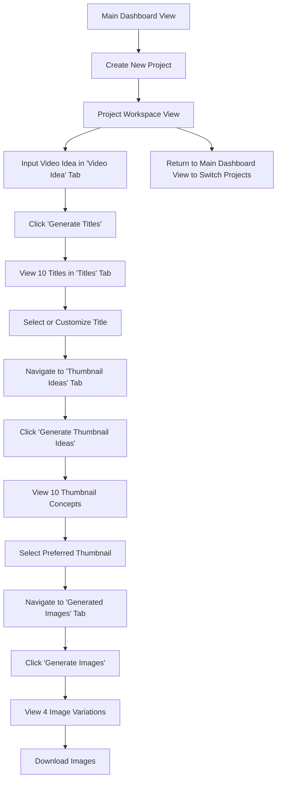

# UI/UX Design Document – [APP NAME]

The goal of this document is to define all UI/UX components, interaction flows, visual language, accessibility guidelines, and implementation-ready specifications for the [APP NAME] project. This document is intended to guide design implementation by engineers (human or AI) and maintain UX consistency. It is both a template and an example for how to structure a comprehensive UI/UX design document for an example application to create video ideas.

## Project Overview

### Product Context
- **Product Name:** [APP NAME]
- **Target Platform(s):** Web / iOS / Android / Desktop / Others
- **Release Scope:** MVP / Beta / v1.0
- **Business Objectives:** e.g. Streamline video idea generation, increase content productivity for creators, etc.
- **Primary Users:** e.g. YouTubers, content marketers, social media managers.

### Target Users & Personas

EXAMPLE:
```markdown
| Persona | Description | Goals | Pain Points |
|--------|-------------|-------|--------------|
| "Creator Clara" | A solo video content creator who publishes weekly. | Fast idea generation, time-saving, aesthetic visuals. | Lacks design skills, struggles with titles. |
| "Marketer Max" | Works in a digital agency managing campaigns. | Scalable asset generation, brand consistency. | Needs approval cycles, dislikes poor UX. |
```

### Key User Journeys

1. **Create New Project**  
   - Navigate to dashboard → Click "Create New Project" → Input initial idea → Enter Project Workspace.
2. **Generate Video Titles**  
   - Input idea → Click “Generate Titles” → Review list → Select or edit title.
3. **Generate Thumbnail Ideas**  
   - Based on selected title → Click “Generate Thumbnail Ideas” → Select one.
4. **Generate & Download Thumbnails**  
   - Click “Generate Images” → View 4 variations → Download preferred image.


## Core Screens & UI Components

### Component Inventory
Next, we list core components and their purposes. Each component should be reusable, accessible, and responsive.

| Component             | Type        | Description                                 |
|-----------------------|-------------|---------------------------------------------|
| Input Text Area       | Form Field  | For entering video ideas                    |
| Title Cards           | Selection   | Clickable options from AI title generation  |
| Thumbnail Concept     | Selection   | Visual/text representations                 |
| Image Grid            | Gallery     | Shows generated thumbnails                  |
| Download Icon/Button  | Action      | Exports generated assets                    |
| Segmented Controls    | Navigation  | Workspace section switching                 |
| Project Cards         | Overview    | Shown on dashboard with preview/status      |
| Sidebar Nav (Optional)| Navigation  | Links to Dashboard, Settings, Help          |
| Status Indicators     | Visual Cue  | E.g., “Draft”, “Completed”, “In Progress”   |


### Interaction Patterns and Core Flows
These are the primary user flows and interactions that define how users will navigate and use the application:

- **Creating a Project**: User clicks "Create New Project," potentially enters an initial working name or idea, and is taken to the Project Workspace view for that new project.
- **Inputting Idea**: User types or pastes their video concept into the "Video Idea" tab. 
- **Generating Titles**: User clicks "Generate Titles." The system processes the idea and displays 10 title options in the "Titles" tab.
- **Selecting/Customizing Title**: User clicks on a preferred title. An option to edit/customize this title appears.
- **Generating Thumbnail Ideas**: After a title is selected/customized, the user navigates to the "Thumbnail Ideas" tab and clicks "Generate Thumbnail Ideas." 10 concepts are displayed.
- **Selecting Thumbnail Idea**: User clicks on a preferred thumbnail concept.
- **Generating Images**: User navigates to the "Generated Images" tab and clicks "Generate Images." 4 image variations appear.
- **Downloading Images**: User can click a download icon/button associated with each generated image. 
- **Switching Projects**: User can navigate back to the Main Dashboard View to select or manage other projects.

This can be visualized as a flowchart:



### Layout Structure
- **Main Dashboard View**:
  - **Navigation Sidebar (Left)**: Potentially icons or minimal text for "Dashboard/Projects," "Settings," "Help/Support." For MVP, this might be very minimal or even just a header navigation if only project listing is needed.
  - **Main Content Area**: Displays a list or grid of video projects. Each project card will show key information like the working title (if generated), a placeholder for a thumbnail, creationmodification date, and status (e-g., "Draft," "Titles Generated," "Thumbnails Selected").
  - **Header**: App logo/name, "Create New Project" button, user profile/account icon (if implementing accounts for MVP).

**Project Workspace View**:
- **Navigation (within workspace)**: Tabs or segmented control at the top of the workspace for "Video Idea," "Titles, " "Thumbnail Ideas," "Generated Images."
- **Content Area (changes based on selected tab)**:
  - **Video Idea Tab**: Large text area for initial idea input (text, with a note about potential future audio transcription).
  - **Titles Tab**: Displays generated titles in a list or card format. Includes an input field for customizing the selected title.
  - **Thumbnail Ideas Tab**: Displays thumbnail concepts (text descriptions or very rough visual placeholders) in a list or card format.
  - **Generated Images Tab**: Displays the 4 generated thumbnail image variations in a gallery or grid layout.


## Visual Language & Branding

### Overall Aesthetic 
Clean, modern, intuitive, and slightly creativity-focused. Should feel efficient but not sterile.

### Colors
Use a modern, professional color palette that conveys trust and creativity.

| Purpose       | Color (Hex)   | Notes                                     |
|---------------|---------------|-------------------------------------------|
| Primary       | `#4A90E2`     | Trustworthy, calming                      |
| Secondary     | `#FAF3E0`     | Light background tone                     |
| Accent        | `#FF6F61`     | Vibrant for highlights & calls to action  |
| Neutral       | `#B0BEC5`     | UI dividers, inactive tabs                |

### Typography
Use a modern, sans-serif font for clarity and readability. Consider using a slightly playful font for headings to add a creative touch.

- **Font Family:** Sans-serif (e.g., Inter, Roboto)
- **Hierarchy:**  
  - H1: 28–32px  
  - H2: 22–26px  
  - Body: 14–16px  
  - Caption: 12px

### General Layout Rules
- **Spacing Unit:** 8px system
- **Card Border Radius:** 12–16px
- **Shadows:** Medium elevation for active elements

### Icons
- Icons should be simple, modern, and convey meaning clearly.
- Use a consistent icon set (Lucide Icons)
- Example: Use a checkmark icon for selection, download icon for image export, etc.

### Component Behavior & States

Each component must define:

- **States:** Default, Hover, Active, Disabled
- **Responsive Behavior:** How it scales on mobile/tablet/desktop
- **Accessibility Tags:** ARIA roles, keyboard navigation
- **Error Handling:** e.g., if title generation fails, show message with retry

**Example:**  
**Component:** Title Card  
- Default: Neutral background, title text  
- Hover: Highlight border + shadow  
- Selected: Filled background, checkmark


## UX Design Principles

- **Clarity over cleverness:** Simple interactions, minimal learning curve.
- **Progressive disclosure:** Show what matters now, reveal complexity later.
- **Familiar patterns:** Follow standard UI expectations (e.g., card lists, modals).
- **Feedback loops:** Every action gets visual confirmation (e.g., toast on image download).
- **Accessibility first:** Color contrast AA+, keyboard nav, alt tags, etc.

## Accessibility Guidelines

- WCAG 2.1 AA compliance
- Keyboard support for all interactions
- Alt text on all images
- High contrast mode supported
- Ensure screen reader landmarks: `role="main"`, `aria-label`, etc.


